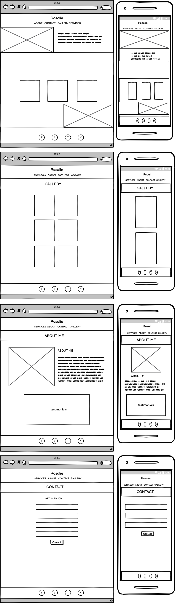

# Milestone Project 1 - Resubmission

### Table of Contents
* [Project Summary](#project-summary)
* [User Experience Design](#user-experinece-design)
    * [The Strategy Plane](#the-strategy-plane)
        * [User Stories](#user-stories)
    * [The Scope Plane](#the-scope-plae)
    * [The Structure Plane](#the-structure-plane)
    * [The Skeleton Plane](#the-skeleton-plane)
        * [Wireframes](#wireframes)
    * [The Surface Plane](#the-surface-plane)
* [Features](#features)
    * [Existing Features](#existing-features)
    * [Future Features](#future-features)
* [Technologies](#technologies)
* [Testing](#testing)
* [Deployment](#deployment)
* [Credits](#credits)

# Project Summary

This Website was created for the sole purpose of completing the first Milestone Project for the Code Institute's Full Stack Developer course. It was built using the knowledge gained from the HTML, CSS and User Centric Design modules. A full list of technologies used can be found in the technologies section of this document.

The live website can be found [here](https://sophieboyle1.github.io/ms1/).

# Rosalie Photography Responsive Website.

Rosalie's Photography website is a personal portfolio of her work over the years, and most recent. It highlights some of her most popular photo's. There is a contact section so you can contact rosalie if you have any questions or wish to book a photo session with her.

# User Experience Design

## The Strategy Plane

As a user I want to: 

* I want to be able to easily navigate throughout the site to find content.
* I want to easily understand the main purpose of the site and learn more about the photographer and their work.
* I want to view the website and content clearly on my mobile device
* I want to find ways to follow the photographer on different social media platforms.
* I want to know a little more about the photographer and there experinece.
* I want to be able to see the photographer's previous work.
* I want to know what styles the photographer can do.
* I want to be able to contact the photographer with any questions I might have.

## The Scope Plane

I want to provide user with a simple overview of who the photographer is, what her skillsare, portfolio and how to contact her.

## The Structure Plane

All Pages will contain a Navigation menu at the top of the Webpage that directs them to a new Page to easily allow users to Navigate the site easily. The Nav Menu will be collapsable on a Mobile device to make use of space on smaller devices. 
The Home Page will contain a small bio about the the photographer. Custom CSS and/or Bootstrap will be used to make the Website responsive by the use of media queries and/or the Boostrap Grid system.

## The Skeleton Plane

### Wireframes

## The Surface Plane

### Colour Scheme
The two main colours used are pale pink #F0ECEC and an off shade of Brown #997F4C as these colours are neutral and easy to read to a white background.I also used a off black #313639, to really highlight text when used on the palepink. The brown and pink shade should compliment each other without being over powering to the eyes.

### Typography
The headers on all pages throughout the Website are using the 'Comorant' font while the main text is using the 'Lato' font. The cursive text I used throughout for the sub headings is 'Homemade Apple'.

### Imagery 
All images are found on [Unplash](https://unsplash.com/)

# Features

## Existing Features

* Desktop view (Alert present on index.html, about.html, gallery.html, contact.html).
* Contact Form - This can be completed on the contact.html page and used in order to contact the photographer with any queries users may have.
* Gallery page - there is a full gallery page with multiple photos.
* Testomonials -  a section with three testomonials on the about page.

## Future Features

* Users would like to have a forum incorporated into the Website. This feature was not implemented as part of the initial release but will be addressed in a future.
* In order to implement the use of the proposed forum, signup and logins would have to be added.

# Technologies

* [HTML](https://www.w3schools.com/html/)
    * This project uses HTML as the main language used to complete the structure of the Website.
* [CSS](https://www.w3schools.com/css/)
    * This project uses custom written CSS to style the Website.
* [Bootstrap](https://getbootstrap.com/)
    * The Bootstrap framework is used throughout this website for layouts and styling.
* [Font Awesome](https://fontawesome.com/)
    * Font awesome Icons are used for the Social media links contained in the Footer section of the website.
* [Google Fonts](https://fonts.google.com/)
    * Google fonts are used throughout the project to import the fonts.
* [GitHub](https://github.com/)
    * GithHub is the hosting site used to store the source code for the Website and Git Pages is used for the deployment of the live site.
* [Git](https://git-scm.com/)
    * Git is used as version control software to commit and push code to the GitHub repository where the source code is stored.
* [Google Chrome Developer Tools]()
    * Google chromes built in developer tools are used to inspect page elements and help debug issues with the site layout and test different CSS styles.
* [Balsamiq Wireframes](https://balsamiq.com/)
    * This was used to create wireframes for 'The Skeleton Plane' stage of UX design.
* [Favicon](https://favicon.io/)
    *Favicon.io was used to make the site favicon
* [Chrome Dev Tools ](https://developer.chrome.com/docs/devtools/)
    * Used throughout the development of the website to quickly see changes and find problems.

# Testing

### Responsive
* This site was was tested on multiple browsers (Google Chrome, Mozzila Firefox and Opera) and on multiple mobile devices (Samsung Galaxy, Huawei, Sony) and it shown responsivness and compatibility.

### Form Testing
* Tested the submit button with no input fields filled in to ensure the form would not submit without the required fields filled in.
* Tested submitting the form without one of each of the required fields and the form will not submit without all required fields filled in.

### Validating code
* HTML
    * Code was validated through W3 validator
* CSS
    * Code was validated through W3 Jigsaw

### Link Testing
* Navigation Menu links were all individually manually tested from each page of the website to ensure the user is directed to the correct page.
* Social Media links in the footer of each page were tested manually to ensure they direct the user to the correct page. As currently the business does not have any active social media sites these links point to the main page for each platform eg. facebook.com etc.

# Deployment

### Project Creation

The project was started by navigating to the [template](https://github.com/Code-Institute-Org/gitpod-full-template) and clicking 'Use this template'. Under Repository name I input MS1 and checked the Include all branches checkbox. I then navigated to the new repository. I then clicked the Code drop down and selected HTTPS and copied the link to the clipboard.

Opening a bash terminal in Visual studio code I then typed git clone link from clipboard followed by open folder and navigating to the newly created local repository. The following commands were used throughout the project:

* git add filename - This command was used to add fils to the staging area before commiting.
* git commit -m **commit message explaining the updates** - This command was used to to commit changes to the local repository.
* git push - This command is used to push all commited changes to the GitHub repository.

### Using Github Pages
* Navigate to the GitHub Repository:
* Click the 'Settings' Tab.
* Scroll Down to the Git Hub Pages Heading.
* Select 'Master Branch' as the source.
* Click the Save button.
* Click on the link to go to the live deployed page.

### Run Locally
* Navigate to the GitHub Repository:
* Click the Code drop down menu.
* Either Download the ZIP file, unpackage locally and open with IDE (This route ends here) OR Copy Git URL from the HTTPS dialogue box.
* Open your developement editor of choice and open a terminal window in a directory of your choice.
* Use the 'git clone' command in terminal followed by the copied git URL.
* A clone of the project will be created locally on your machine.

# Credits

## Code

* The gallery layout was found from [Freecodecamp](https://www.freecodecamp.org/news/how-to-create-an-image-gallery-with-css-grid-e0f0fd666a5c/)
* The testomonials on the about page was taken from [bbbootstrap](https://bbbootstrap.com/snippets/bootstrap-testimonial-card-section-72258218)

## Media

* All the media found on the site is from [Unsplash](https://unsplash.com/)

## Content

* The content was mostly written by me, but i did get some of the information from..
* [simonpearephotography](https://www.simonpearephotography.com/wedding-photography-packages-and-prices)
* [solophotography](https://www.google.com/search?q=solo+photography+package&sxsrf=ALeKk01nJdmrb0jsgW6_33idez_icucHaQ%3A1617453732729&ei=pGJoYOSOLJu71fAPj7qzqAU&oq=solo&gs_lcp=Cgdnd3Mtd2l6EAEYADIECCMQJzIECAAQQzIECAAQQzICCAAyBAgAEEMyCAguELEDEIMBMgUILhCxAzIOCC4QsQMQgwEQxwEQrwEyAggAMgIIADoOCC4QsQMQgwEQxwEQowI6CAgAELEDEIMBOgUIABCxAzoICC4QxwEQowI6CggAELEDEIMBEEM6CAguEMcBEK8BUJ0PWPwRYOobaABwAngAgAH-A4gBlQeSAQcxLjMuNS0xmAEAoAEBqgEHZ3dzLXdpesABAQ&sclient=gws-wiz)

## Acknowledgements
* I'd like to thank my mentor Spencer Barriball for his patience and guidance throughout my project.
* My tutor Roman at the Kerry ETB for all the support he gives daily.
* All at Code Institute and Tutor support.

